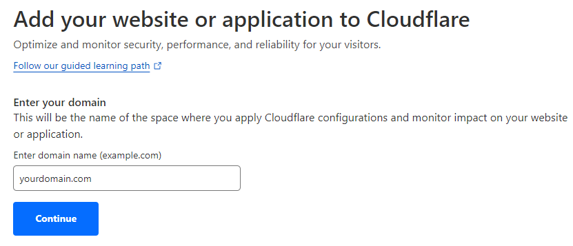
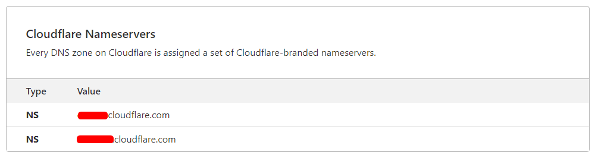
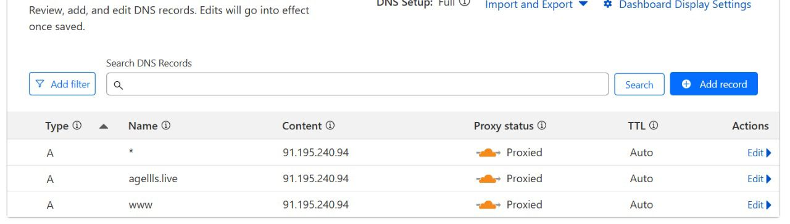
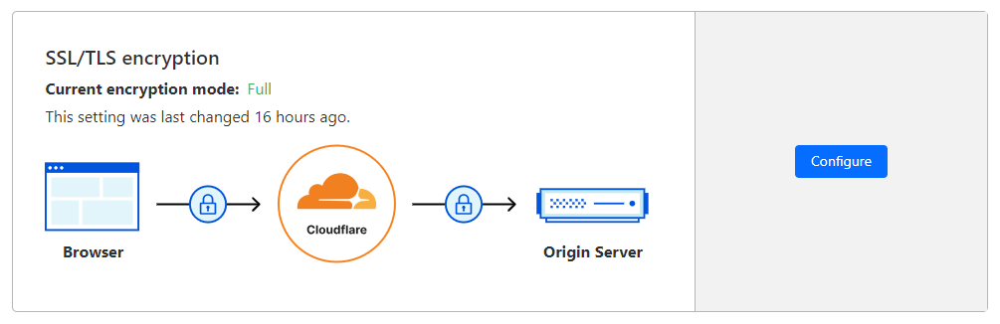
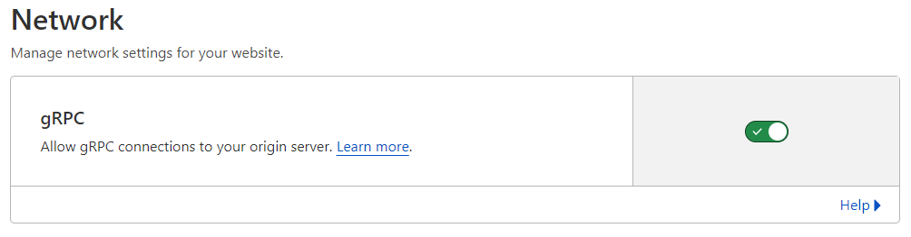
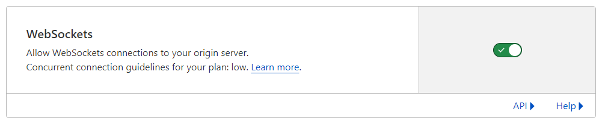
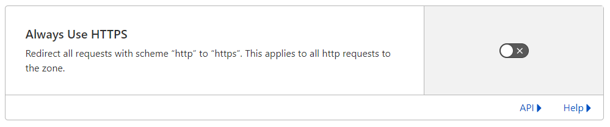
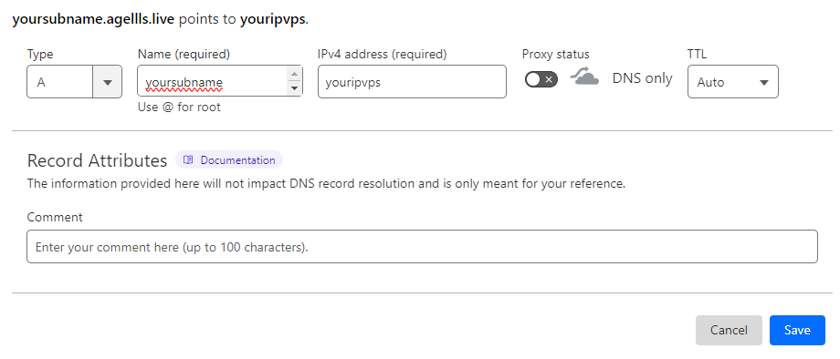
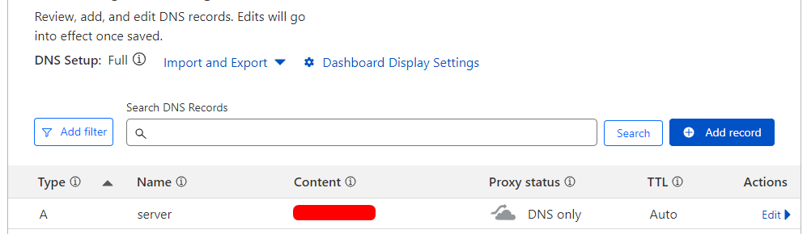

# Pointing domain to cloudflare for ssh or tunneling

The first time is you have to create account <a href="https://dash.cloudflare.com/login">cloudflare</a>

## Pointing Domain

<li> Add your domain like this picture, then press continue

<li> After that please input the nameservers to your domain nameservers

<li> Delete all DNS management on there until empty

## Setting cloudflare

- SSL/TLS : FULL
- GRPC (Network) : ON
- WEBSOCKET (Network) : ON
- Always Use HTTPS (SSL/TLS > Edge Certificates) : OFF

Finally the setup done, now if you wanna use the pointing to vps the step like this

## Pointing IP VPS

<li> Now this how to pointing your ip VPS

- type = "A"
- Name (required) = yoursubname
- IPv4 address (required) = youripvps
- Proxy status = off (DNS only)
- TTL = Auto

then save, and here we go now your domain and your ip vps ready to use create shh, happy coding :D
